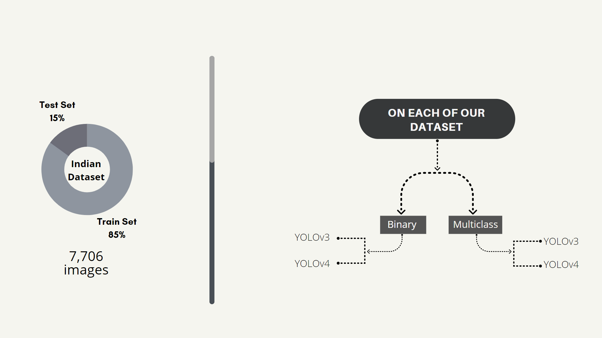
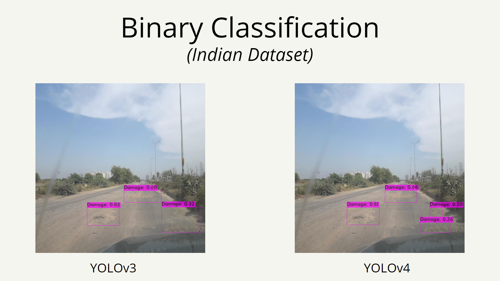
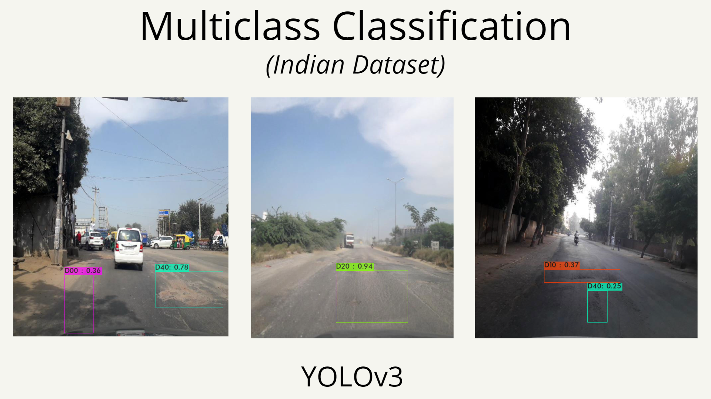
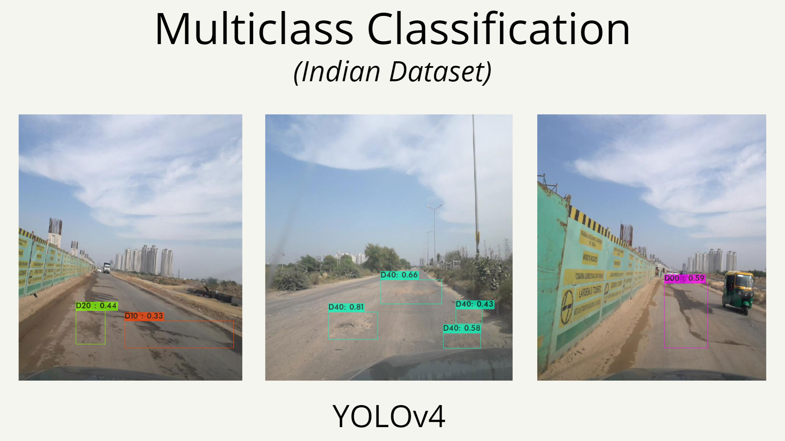
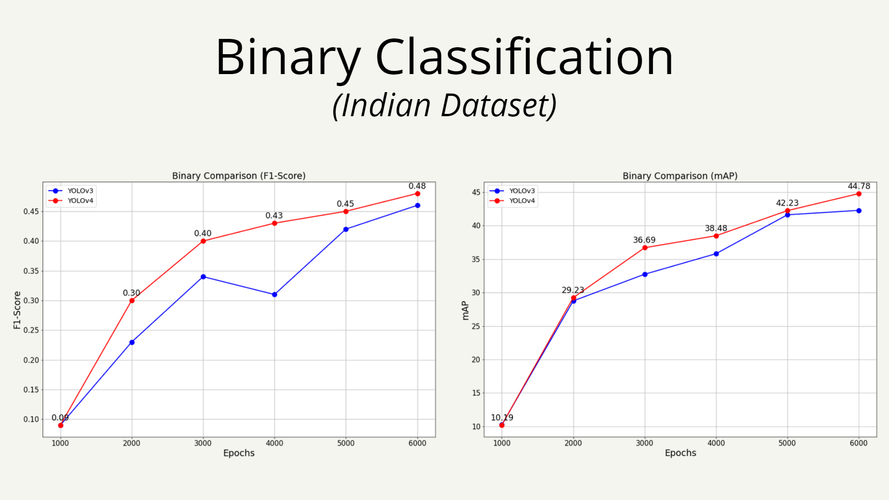
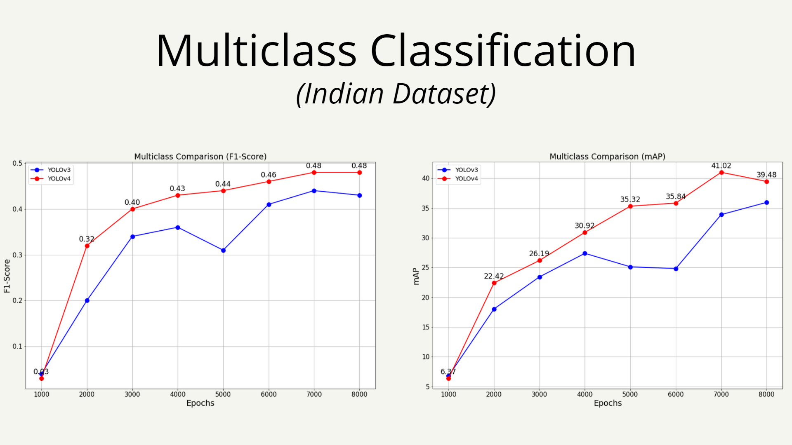
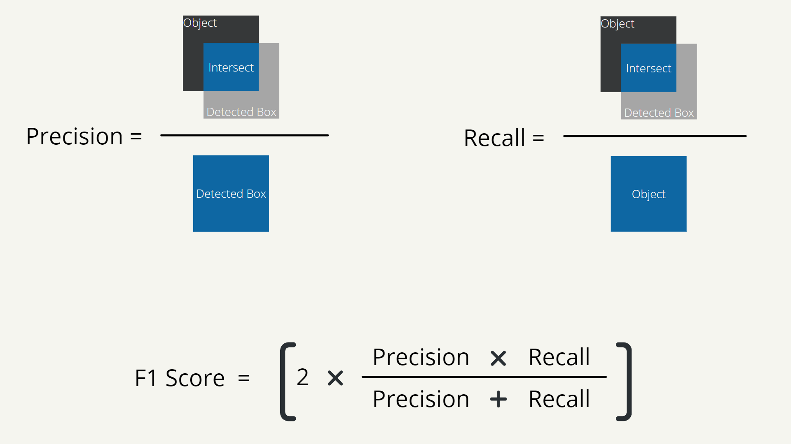
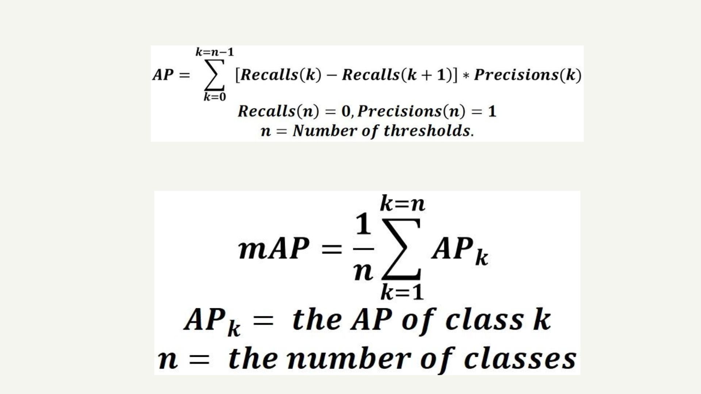

# road-damage-detection-using-YOLO

### _**Disclaimer:**_ 
This repository mostly contains the codes of my undergrad thesis work. But there are many other utility stuff like: datasets, cfg files, custom weight files - which are very essential to make the code work out, and sorry to say, those files are __not included here__ as they consume a lot of storage. I will try to fix this issue asap. And will provide a detail guideline on how I've trained my models.

    

---

### `My Topic:` 
In my research I tried to make models that can detect road-damages from a given image. To do so I've used a deep learning algorithm named You-Only-Look-Once (YOLO). 

---

### `Why YOLO? ` 
In recent times YOLO has become one of the most popular object detection algorithms as it requires only one forward propagation pass through the neural network to perform object detection. Unlike many other object detection methods, YOLO applies a single neural network to the entire image at once, rather than going through the whole image thousands and thousands of times. This is the core reason why YOLO can detect objects in real-time speed along with higher accuracy.

---

### `YOLOv3 and YOLOv4:` 
I've used two different versions of YOLO algorithm, such - YOLOv3 and YOLOv4, to make both binary and multi-class detections. So, it makes a total of 4 different models that can detect road-damages from a given image. The models can be named as following-

- Binary Classification using YOLOv3
- Binary Classification using YOLOv4
- Multi-class Classification using YOLOv3
- Multi-class Classification using YOLOv4

All of these models have been implemented using the __DARKNET__ framework. The training of my models has been done over cloud by using google-colab. For binary classification I've run the models for 6000 epochs. And for multi-class classification I've run the models for 8000 epochs.

---

### `Dataset:` 
I've used an indian dataset to train my models. This dataset has 7706 images, of which I've split 85% into the training set, and other 15% to the test set. Here no validation set has been used.

---

### `Damage Detection:`
The main task of the models is to detect damages from images. It requires both classification and localization. 

In the case of binary classification, the model creates a bounding box around the damage along with a label and a confidence-score. The label is named as _Damage_ for binary classification.

- #### `Samples of Binary Classification using YOLOv3 and YOLOv4:` 

---

In case of multi-class detection, the model also creates bounding-boxes around the damages with a label and a confidence score, but this time the damage is labeled according to the _type of damage_ as mentioned below:

| Label       | Type of damage  |
| ----------- | ----------- |
| D00         | Linear Longitudinal cracks       |
| D10         | Linear Lateral cracks        |
| D20         | Alligator cracks        |
| D40         | Other Damages         |

- #### `Samples of Multi-class Classification using YOLOv3:` 

---

- #### `Samples of Multi-class Classification using YOLOv4:` 

---

### `F1-Score and mAP comparisons for binary models:`

---

### `F1-Score and mAP comparisons for multi-class models:`

---

### `F1-Score calculation for object detection:`

---

### `mAP calculation for object detection:`

---

### `Helpful Resources:`

1.   [YOLOv4 in the CLOUD: Install and Run Object Detector (FREE GPU)](https://www.youtube.com/watch?v=mKAEGSxwOAY)

2.   [YOLOv4 in the CLOUD: Build and Train Custom Object Detector (FREE GPU)](https://www.youtube.com/watch?v=mmj3nxGT2YQ&ab_channel=TheAIGuy)

3.   [how to train YOLO v3, v4 for custom objects detection | using colab free GPU](https://www.youtube.com/watch?v=hTCmL3S4Obw)